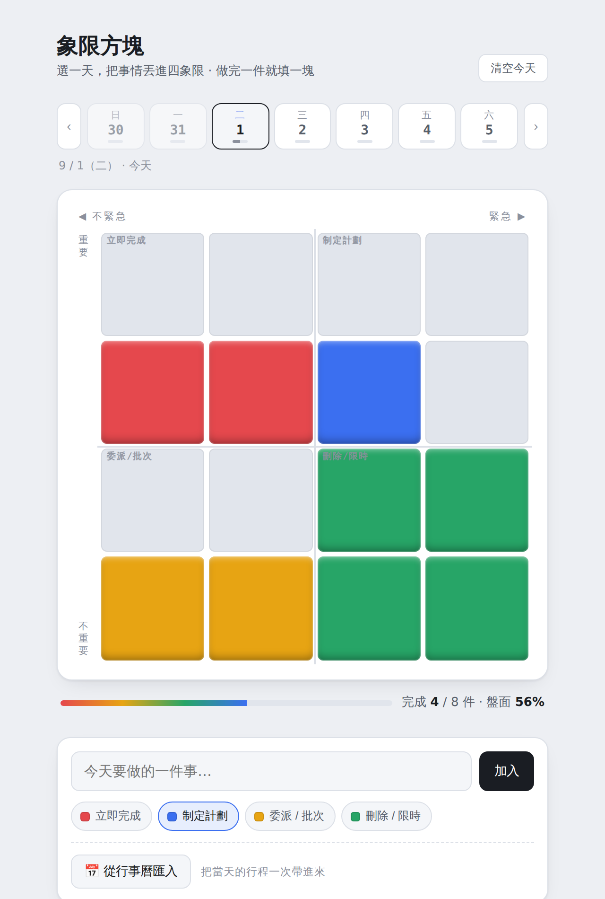

# 象限方塊 Quadrant Blocks

> 把每天的待辦丟進艾森豪四象限，做完一件就在對應顏色的方塊上填一格——一個讓「優先順序」變得看得見的工具。

### ▶ 直接打開來用：**[kelly21294.github.io/quadblocks](https://kelly21294.github.io/quadblocks/)**

不用安裝、不用註冊、不用給任何權限，手機和電腦都能開。

（畫面中為示範任務）

---

## 它想解決什麼

那陣子我同時在跑履歷、面試準備、雅思、健身和社團的事。一開始我以為我需要一個更好的待辦清單，但誠實面對之後發現，**我的問題不是「忘記做事」**——忘記做事，隨便一個清單 App 就能解決。我真正卡住的是兩件事：

- **看不到自己推進了多少。** 清單只會愈列愈長，打勾的回饋很薄，一天結束我還是說不出今天到底有沒有前進。
- **分不清哪些事真正重要。** 清單把所有事排成平的一條，看起來每件都一樣重，它從來不會問我：這件事到底值不值得做。

所以這個工具解的不是記錄，是**判斷和回饋**。

## 怎麼用

1. 上方的週曆點一天（預設今天，也可以先排後天）
2. 打一件事，選一個象限，按加入
3. 做完打勾——對應象限的方塊會由下往上填色，盤面本身就是進度

資料存在你自己的瀏覽器裡，離線可用，不會上傳到任何地方。刪錯了按提示條上的「復原」，或 Cmd / Ctrl + Z。

## 四個象限

| 象限 | 意義 | 策略 | 顏色 |
|---|---|---|---|
| 立即完成 | 重要且緊急 | 立刻做，但儘量減少（避免長期高壓） | 🔴 紅 |
| 制定計劃 | 重要不緊急 | 投入最多時間（關鍵產出區） | 🔵 藍 |
| 委派 / 批次 | 緊急不重要 | 交給別人或集中處理 | 🟡 黃 |
| 刪除 / 限時 | 不重要不緊急 | 直接刪除或給它時間上限 | 🟢 綠 |

**顏色在這裡不是裝飾，是行動指令。** 而且失衡本身就是洞察：如果某天紅色填滿、藍色空空，一眼就知道「今天都在救火，沒做到關鍵產出」——畫面自己在提醒我調整。

## 功能

- 四象限分類，一週任一天都能規劃
- 點選或拖曳改分類，完成度換算成填色方塊
- **跨日自動整理**：完成的歸檔、沒做完的移到今天，不用記得按任何按鈕
- **Google 日曆整合**：一鍵匯入當天行程；只需授權一次，之後自動保持連線
- **會議自動建立**：任務名稱裡有「會議／訪談／面試／例會」時主動詢問，填完時間一鍵建立日曆活動並附上 Google Meet 連結
- **年度回顧**：一整年的格子圖，看得到連續性也看得到空白期
- **復原**：刪除、清空、匯入覆蓋都救得回來
- 純文字匯出／匯入，資料可搬到任何裝置
- 桌面浮動入口（macOS）：永遠置頂的小方塊，點一下開啟工具

## 三個設計判斷

完整的十二次迭代寫在 **[設計歷程 DESIGN.md](DESIGN.md)**，這裡先講三個最能代表這個專案的：

**分類是會變的，工具就不能假設它不會變。** 事情會升級也會降級，有時候只是當下放錯格。第一版只能刪掉重打，後來改成隨時可以點一下或拖到別的象限。

**維護成本不該丟給使用者。** 第一版每天要手動按「新的一天」才會清空，但人一定會忘記，忘記就整盤失去意義。現在跨日會自動結算，未完成的移到今天——因為那些事隔天還是要做。

**自動化省的是打字，不是判斷。** 行事曆匯入是把當天行程**全部拉進來讓你自己勾**，不靠顏色或關鍵字自動篩；會議偵測也只是「開口問」，要不要建、幾點、多久永遠是你按下去才發生。工具負責省掉重複勞動，不負責替人決定什麼重要。

## 技術

- 純 HTML / CSS / JavaScript，**單一檔案、零相依套件**
- 資料持久化：瀏覽器 `localStorage`
- Google Calendar API + Google Identity Services（OAuth 2.0，讀取日曆＋建立活動，含靜默續約）
- 響應式版面，支援深色 / 淺色主題
- 桌面外殼：Electron（只負責永遠置頂與開啟，不重複實作任何功能）
- 每次改動跑自動化瀏覽器測試，目前累積約 190 項檢查

架構上的判斷（資料／計算／畫面分離、行事曆切成三段、所有 Google 呼叫收斂到單一入口）寫在 [DESIGN.md](DESIGN.md)。

## 關於這個專案

我沒有寫程式的背景。這個工具是我自己定義問題、設計方案、再一步步做出來的——邊做邊學。

過程中最有價值的不是第一版，而是**自己用了幾天之後發現的那些問題**：入口做得太小自己都找不到、每天要手動重置、資料綁在網址上換個地方就不見、還有「今天／明天」根本不該被寫死。十二次調整裡有十一次，設計階段一個都沒想到。

對我來說它證明的一件事是：**看到問題，我有辦法把它變成能用的東西，而且會持續修到它真的好用。**

---

MIT License · 個人專案 2026
